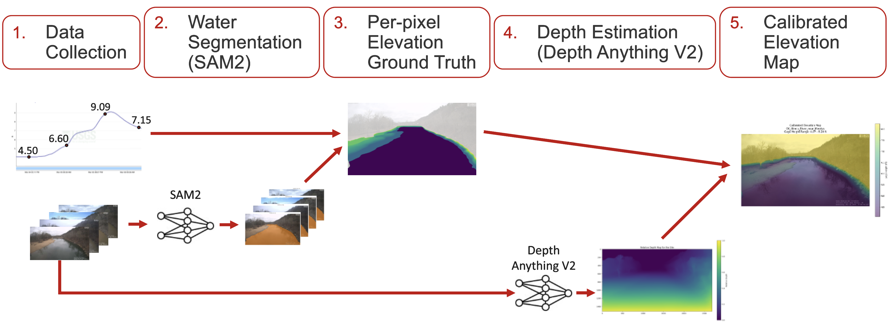

## Motivation

For this project, we aimed to develop a vision system that can accurately estimate water level data from camera images of rivers, streams, and lakes. The United States Geological Survey (USGS) monitors the water level of different bodies of water at numerous locations across the United States using different gauges and cameras. Rather than relying on costly gauges to record the time varying water level of a site, we seek to create a system that can accept images of these sites and predict their corresponding water level. While this is often accomplished with water level markers or gauges being present in the image, we hope to leverage information in images and in the entire scene to determine water level variations. 

## Approach

The following is a high level overview of the vision approach we used to estimate water level in images: 

    

1. Capture New Image - A new unseen image of a water body is collected for processing.
2. Segment Water Mask - The collected image is segmented using a deep learning segmentation model (like Segment Anything Model) to produce a mask of the pixels representing water in the image. This is one of two inputs into the water level extraction process, which will be descirbed in full in the [Implementation](#implementation) section.
3. Provide Elevation Map - An elevation map, which provides the known real-world elevation at each pixel in the image, must also be supplied as an input.
4. Extract Water Level - The position of the water mask is compared to the elevation map to produce a new water level estimate.

### Site Selection 
A key component of this project was the data. We searched the USGS Hydrologic Imagery Visualization and Information System (HIVIS) [wepage](https://apps.usgs.gov/hivis) and identified 8 sites from across the country as good candidates for our project. When choosing these sites we considered several different factors: 
1. Visibility of the Shoreline - We chose sites that had a very distinct shoreline in the images. Some sites have the camera directed at large bodies of water so the shoreline is very far away and small. Others have lots of growth in the images that make the water edge hard to see. Since our method relies upon clearly identifying the water level on the shore, choosing sites that met this criteria was vital. 
2. Obvious Visual Changes with Water Level - Another important factor was choosing sites with clear changes in the images with changes in water level. For sites with larger bodies of water or cameras far away, a change in the water level is not always visible. To avoid this, we chose sites where the bank of the river changes drastically with water level. 
3. Water Level Variation - To allow for better estimates of the water level, we chose sites that had large changes in water level.
4. Site Variation - While we aren’t focusing on radically different sites, we still wanted some variation in the size of the rivers, orientation of the cameras, and distance from the water in our sites to test the robustness of our method. Because of this we chose a variety of locations of different types.
5. Data Availability - While many sites are listed on the HVIS website, not all of the sites had corresponding river level readings and time matched images. We specifically chose sites with a variety of images and their corresponding water levels.
6. Weather - Since our method relies on the shoreline, it will completely fail when the river freezes. For this reason, we chose a variety of sites that are in a southern climate and didn’t show any signs of freezing in the images. For the sites that did have winter, we marked them in a table.
7. Night Time Images - Some cameras in the HVIS database have IR night vision cameras while others don’t record night events at all. Some night modes perform very poorly, so we avoided sites with bad data and marked which sites had good or no night time data. 

Below is an example image from each of our selected test sites:

  

    
    
East Branch Pecatonica River NR Blanchardville, WI <small>USGS-05433000</small>

  

  

    
    
Arroyo DE LA Laguna a Corte Madrid NR Pleasanton <small>USGS-11176340</small>

  

  

    
    
Illinois River near Moodys, OK <small>USGS-07196320</small>

  

  

    
    
Breitenbush River above French Creek NR Detroit, OR <small>USGS-14179000</small>

  

  

    
    
Waccamaw River at SC-22 Below Longs, SC <small>USGS-02110525</small>

  

  

    
    
Difficult Run Above Fox Lake Near Fairfax, VA <small>USGS-01645704</small>

  

  

    
    
Black Earth Creek nr Brewery Rd at Cross Plains, WI <small>USGS-05406457</small>

  

  

    
    
Silver Creek at State Highway 21 Near Angelo, WI <small>USGS-05382284</small>

  

## Implementation

### Elevation Map

Ideally, the elevation map generation step discussed in the [Approach](#approach) would be accomplished with a physical survey of the scene, like a lidar scan, calibrated to the camera's view of the scene. However, since we did not have the means to physically access our test sites, we instead relied on historical images and data to provide us with an estimate of scene elevations in the image. The following steps were taken to generate an elevation map for each individual test camera:

    

1. Data Collection - First, we gathered historical images covering a wide range of water levels.
2. Water Segmentation - Then, we used the Segment Anything Model Version 2 in order to produce water masks for each image.
3. Per-Pixel Elevation Ground Truth - Next, the water masks were overlaid on top of each other and combined with the water level data, and an elevation map was computed by taking the lowest observed elevation at each pixel.
4. Depth Estimation - After that, a depth map of the scene was created using the Depth Anything Version 2 depth estimation model.
5. Calibrated Elevation Map - And then finally, a polynomial regression was fit to map relative depth and pixel y coordinate to gage height, generating a calibrated elevation map. 

This output elevation map is now ready to be used as an input to the water level extraction process.

### Water Level Extraction

    

To extract the water level from an image, three inputs are needed: the image itself, an elevation map of the scene for each pixel, and a relative depth map for the image indicating the distances from the camera to each pixel. The elevation map and depth map can be extracted from the scene and then used for all future predicitons. With these three inputs, the algorithm identifies where the water meets the shore and extracts the elevations corresponding to that specific shoreline, since each water level corresponds to a unique shoreline location in the image.    

With these inputs the following steps occur:
1. Mask Extraction - A mask of the water in the image is extracted. This can be done with a Neural network such as the segment anything model (SAM).
2. Mask Cleaning - The mask is often full of unwanted holes and artifacts. To fix this a series of dialations and errosions that expand and contract the mask are used to filled the empty space.
3. Edge Extraction - To extract the edges of the mask, first diatliton is applied to the mask. Is shirnks the mask by 1 pixel. Then the smaller mask is subtracted from the original to leave just the edge pixels as a mask.

4. Edge Trimming - Since short edges are likely to only be artifcats, the edges are labeled using 4-connectivity and edges that are too short are removed. The result is a clean edge mask that can be used for extracting pixel values.

5. Compute Weighted Median - Use the edge mask to extract the corresponding elevation and depth values. Using these values, computed the weighted median for each river bank using the distance from the camera as a weight (closer = larger weight). To account for instances where very small changes in the pixel locations result in major elevation changes, a confidence score is also computed based on the gradient of elevation map and pixels with a very large gradient are given a lower confidence score and weight.
6. Combine Banks - Finally, combine the estimates from each bank using the variance in banks water level predictions. The result is the predicted water level.

## Results
We tested our algorithm on a total of 8 different sites, each with a variety of setups and characteristics. For all sites we used the masks fpr the images to generate our elevation map and then tested our extraction using these same masks. For three sites, we additionally tested on completely different images of the site not used to generate the depth map. Even when tested on unseen images, our method performed very well matching the general trends of the true data. 

| Number | Site                                                   | Seen/Unseen/Both?| MEA (ft.) |
|-|-------------------------------------------------------------- | ---- | -----       |
|1| WI_East_Branch_Pecatonica_River_near_Blanchardville_Bullet    | Both | 0.106/0.069 |
|2| CA_Arroyo_DE_LA_Laguna_A_Corte_Madrid_nr_Pleasanton           | Both | 0.276/0.398 |
|3| OK_Illinois_River_near_Moodys                                 | Both | 0.190/0.26  |
|4| OR_Breitenbush_River_above_French_Creek_near_Detroit          | Seen | 0.338       |
|5| SC_Waccamaw_River_at_SC_22_below_Longs                        | Seen | 0.181       |
|6| VA_DIFFICULT_RUN_ABOVE_FOX_LAKE_NEAR_FAIRFAX                  | Seen | 0.132       | 
|7| WI_Black_Earth_Creek_nr_Brewery_Rd_at_Cross_Plains_PIV        | Seen | 0.073       |
|8| WI_Silver_Creek_at_State_Highway_21_near_Angelo               | Seen | 0.243       |

    <b>1. WI_East_Branch_Pecatonica_River_near_Blanchardville_Bullet</b>: Example Image, Elevation Map, and Relative Depth Map  
    
      
        
    Predicitons Vs. Ground Truth (Left: Seen, Right Unseen)  
        
         
    LEFT - MAE: 0.106 ft, Range: 4.6-10.91ft.  
    RIGHT - MAE: 0.069 ft. 

 

    <b>2. CA_Arroyo_DE_LA_Laguna_A_Corte_Madrid_nr_Pleasanton</b>: Example Image, Elevation Map, and Relative Depth Map  
    
      
        
    Predicitons Vs. Ground Truth (Left: Seen, Right Unseen)  
        
      
    LEFT - MAE: 0.276 ft, Range: 5.61-14.42ft.  
    RIGHT - MAE: 0.398 ft.

 

    <b>3. OK_Illinois_River_near_Moodys</b>: Example Image, Elevation Map, and Relative Depth Map  
    
      
        
    Predicitons Vs. Ground Truth (Left: Seen, Right Unseen)  
        
         
    LEFT - MAE: 0.190 ft, Range: 4.07-8.24ft.  
    RIGHT - MAE: 0.26 ft.

 

    <b>4. OR_Breitenbush_River_above_French_Creek_near_Detroit</b>: Example Image, Elevation Map, and Predictions (Seen)  
    
       
       
      MAE: 0.338 ft, Range: 10.78-21.74ft.  

 

    <b>5. SC_Waccamaw_River_at_SC_22_below_Longs</b>: Example Image, Elevation Map, and Predictions (Seen)  
    
       
        
      MAE: 0.181 ft, Range: 4.69-8.03ft.  

 

    <b>6. VA_DIFFICULT_RUN_ABOVE_FOX_LAKE_NEAR_FAIRFAX</b>: Example Image, Elevation Map, and Predictions (Seen)  
    
       
        
      MAE: 0.132 ft, Range: 1.1-4.9ft.  

 

    <b>7. WI_Black_Earth_Creek_nr_Brewery_Rd_at_Cross_Plains_PIV</b>: Example Image, Elevation Map, and Predictions (Seen)  
    
       
      
      MAE: 0.073 ft, Range: 2.31-2.76ft.  

 

    <b>8. WI_Silver_Creek_at_State_Highway_21_near_Angelo</b>: Example Image, Elevation Map, and Predictions (Seen)  
    
       
        
      MAE: 0.243 ft, Range: 6.03-8.54ft.  

 

## Discussion

### Strengths
Even though our method is not perfect, it apperears to work fairly well producing estimates that properly follow the water level trends. It seems promising that our method could have some real value in the field.

### Challenges - Real World Data is Difficult
Throughout this project we have encountered many challenges, mostly stemming from the fact that real world data is messy and difficult to work with.

#### Mask Issues 
Our method relies heavily upon the quality of the water masks fed into it. We used neural networks to aquire our masks which worked farily well, especially compared to more rudamentary approaches; however, despite our best efforts, these were often corrupted by factors such as:
1. Lighting - Since the pictures are taken throughout the day, the lighting changes drastically and harsh shadows made the mask predictions fail.
2. Reflections - When the water surfaces are very still, they produce clear reflections that are difficult to differentiate from the true objects. As a result, the water boundary was sometimes difficult to estimate. 
3. Darkness - Despite being equiped with IR cameras, the cameras often had worse quality night images. The drastic change in the scene from day to night also made the model fail to mask the water surface. 
4. Poor Weather - Rain streaks on the camera lens and blur caused by drops often made images completely unusable or created large gaps in the masks.
5. Grass and Plants - Plants at the edges of the rivers, made it diffucult to see the shore line and made it difficult to properly mask the water.

These issues in the masks ultiamtely resulted in errors in our elevation maps and in the water level estimation. By using even better segmentation tools, we might be able to get better results. 

#### Elevation Map Fitting 
When generating calibrated elevation maps, we used the water level information as well as a depth estiamate from a neural network. While fitting the data this way worked for some scenes where the river was viewed from the side, for scenes where the river was viewed from above, the depth information was wrong and the fit failed. To fix this, we only used the fit to extrapolate to unseen points in the scene and used the raw mask values where they were recorded. 

#### Cross River Masks
While ideally our method seperates the different banks of the river, often the mask of the water would not terminate at the edges of the image. As a result, the edges would be fully connected, including points that were in the middle of the river. We attempted to mitigate this by weighting these pixels by depth; however, this did not full fix the issue. As a result, many estiamtes were skewed lower since the middle river pixels correspond to low water levels. 

### The Future
In the future this method could be improved by:
- 3D Elevation Map Generation - Rather than using historic data, 3D elevation maps of the site could be captured with LIDAR and matched to the camera images. 
- Full Prediction based on Neural Network - With the proper setup, a model could be trained to predict the water level directly from the images and elevation maps.
- Implement in the field - This method could be applied to future sites and remove the need for water level gauges.
